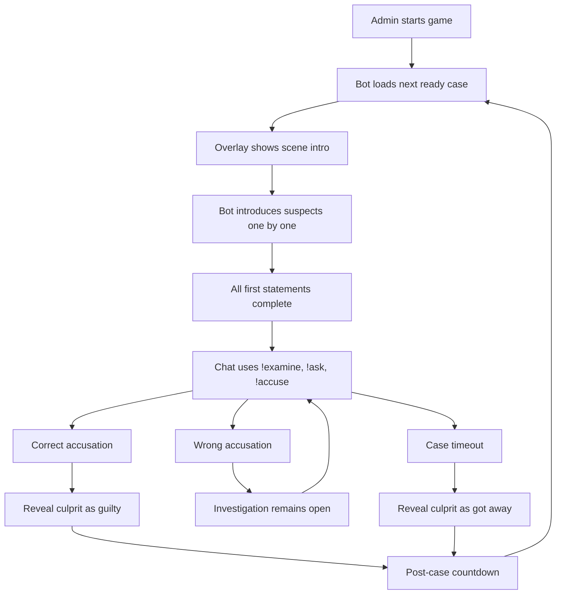

## 1. Product Overview
THE CASE is a Twitch-native detective game where chat solves fictional cases through timed suspect statements, evidence examination, and limited accusations. It combines a bot-controlled game loop, a stream overlay, and a public leaderboard into a single viewer engagement system.

- The product is designed for a single streamer ecosystem on `case.teewee.live`, with the bot controlling pacing and the overlay turning the investigation into a watchable stream format.
- The main value is repeatable live audience participation: viewers investigate together, compete for points, and return across cases and seasons.

## 2. Core Features

### 2.1 User Roles
| Role | Registration Method | Core Permissions |
|------|---------------------|------------------|
| Viewer / Player | Twitch chat identity | Use gameplay commands, earn points, appear on leaderboard |
| Broadcaster / Moderator | Twitch role in chat | Start, stop, pause, resume, skip, reload, monitor status |
| Stream Admin | Admin page password | View runtime status, trigger admin controls, edit live settings |

### 2.2 Feature Module
1. **Public leaderboard page**: season rankings, player stats, ranking context
2. **Overlay page**: scene intro, suspect display, accusation result, timeout reveal
3. **Admin page**: live controls, current state, editable settings
4. **Chat game loop**: command parsing, phase gating, scoring, cooldowns, case rotation
5. **Case generation pipeline**: AI case generation, validation, avatar generation, case review

### 2.3 Page Details
| Page Name | Module Name | Feature description |
|-----------|-------------|---------------------|
| Leaderboard | Season table | Show current season ranking, points, rank, titles, solved cases, wrong guesses, accuracy, evidence examined |
| Leaderboard | Player summary surface | Highlight progression and season context without requiring sign-in |
| Overlay | Scene intro | Display a dramatic intro card when a case begins |
| Overlay | Suspect presentation | Show active suspect portrait, name, and speaking state during scripted timeline beats |
| Overlay | Result state | Show `GUILTY` or `INNOCENT` using accuser + suspect portraits |
| Overlay | Timeout reveal | Show culprit only with `GOT AWAY` state and dramatic framing |
| Admin | Runtime controls | Start, stop, pause, resume, skip, reload |
| Admin | Live settings editor | Edit tunables stored in Supabase without redeploy |
| Admin | Status monitor | Show active case, phase, pause state, and core timings |

## 3. Core Process
The normal user journey begins in chat. A case starts, the overlay introduces the investigation, and the bot delivers suspects one by one. Once all first statements are complete, chat unlocks commands for evidence checks, statement repeats, and accusations. The first correct accusation ends the case; wrong accusations continue play, but each player only gets two guesses. If time runs out, the culprit is revealed as having got away, along with a hidden solution summary in chat.

The broadcaster or moderators can control the experience at any time through chat commands, while the admin page offers a quieter operational view for adjusting live settings and runtime state. Outside stream moments, the public leaderboard page gives the community a persistent place to view the current season standings.

## 4. User Interface Design

### 4.1 Design Style
- Primary colours: charcoal, smoke grey, blood red accent, muted green for truth states
- Secondary colours: aged gold, ivory text, faint cyan/blue for subtle UI separators
- Button style: tactile but restrained, slightly theatrical, rounded rectangles with glow or border emphasis
- Fonts and sizes: cinematic display font for headings, readable editorial body font for data-rich surfaces, large verdict typography on overlay
- Layout style: desktop-first, card-driven, asymmetric framing on overlay, structured data layout on leaderboard/admin
- Icon style suggestions: magnifying glass, case file tabs, evidence chips, theatrical investigation motifs

### 4.2 Page Design Overview
| Page Name | Module Name | UI Elements |
|-----------|-------------|-------------|
| Leaderboard | Rankings table | Dark editorial table, season indicator, profile metrics, subtle hover emphasis |
| Leaderboard | Top player spotlight | Highlight card, badge/title treatment, stats summary |
| Overlay | Scene intro | Glowing frame, emblem/icon, motion-led entrance, heavy focus on atmosphere |
| Overlay | Suspect card | Circular portrait frame, name lockup, speaking tag, minimal supporting text |
| Overlay | Result state | Split portrait layout for accusation results, bold central verdict |
| Overlay | Timeout reveal | Single culprit portrait, stronger dramatic framing, `GOT AWAY` label |
| Admin | Controls panel | Dense utility layout, fast-access controls, clear state visibility |
| Admin | Settings editor | Inline form controls, save actions, current-value display |

### 4.3 Responsiveness
The product is desktop-first. The leaderboard and admin page should remain usable on tablet widths, but the overlay is designed specifically for browser-source use in OBS. Mobile adaptation is helpful for the public leaderboard, but not the primary target for the initial release.
