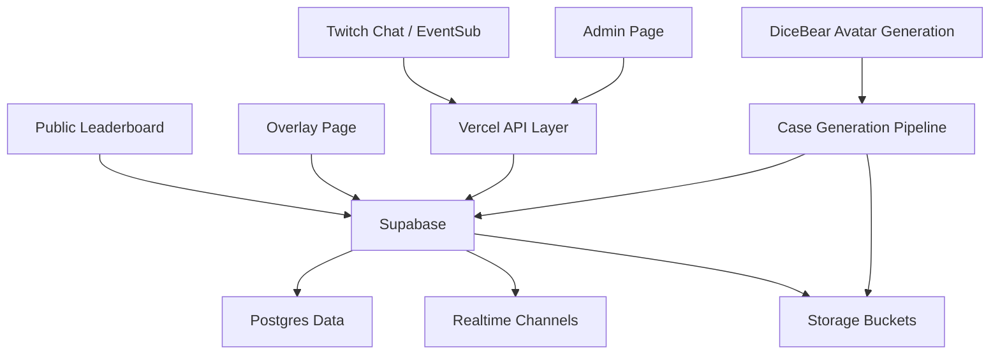
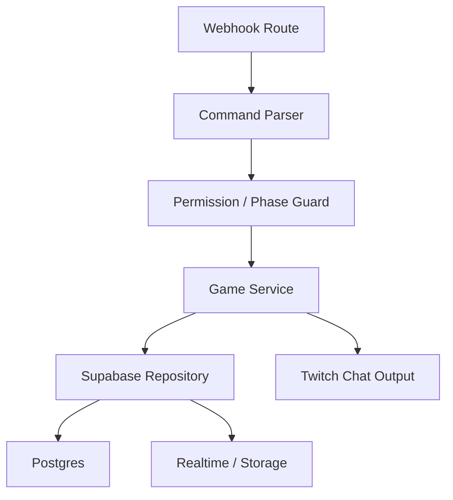
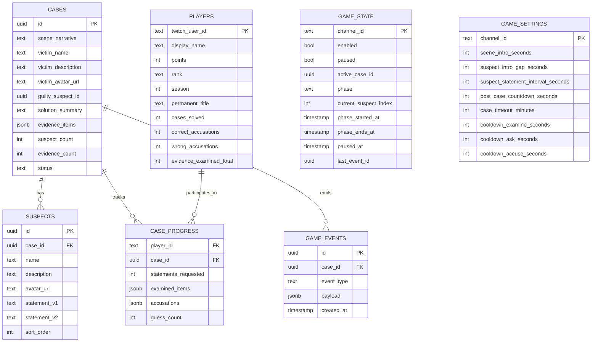

## 1. Architecture Design



## 2. Technology Description

- Frontend: React 18 + Vite + Tailwind CSS
- Runtime hosting: Vercel
- Data layer: Supabase Postgres + Supabase Realtime + Supabase Storage
- Backend pattern: Vercel serverless routes for Twitch webhook handling and admin actions
- External services: Twitch EventSub / chat API, DiceBear avatar generation, local or external case generation workflow

## 3. Route Definitions
| Route | Purpose |
|-------|---------|
| `/` | Public leaderboard showing current season stats |
| `/overlay` | OBS/browser-source overlay page for the active case |
| `/admin` | Password-protected admin operations page |

## 4. API Definitions

### 4.1 EventSub Intake

```ts
type TwitchChatWebhookPayload = {
  subscription: {
    type: 'channel.chat.message';
  };
  event: {
    broadcaster_user_id: string;
    chatter_user_id: string;
    chatter_user_name: string;
    message: {
      text: string;
    };
    badges?: Array<{
      set_id: string;
      id: string;
    }>;
  };
};
```

### 4.2 Leaderboard API

```ts
type LeaderboardEntry = {
  twitchUserId: string;
  displayName: string;
  points: number;
  rank: 'Rookie' | 'Detective' | 'Senior Detective' | 'Chief Detective';
  permanentTitle: string | null;
  casesSolved: number;
  correctAccusations: number;
  wrongAccusations: number;
  evidenceExaminedTotal: number;
  accusationAccuracy: number;
};
```

```ts
type LeaderboardResponse = {
  season: number;
  updatedAt: string;
  entries: LeaderboardEntry[];
};
```

### 4.3 Admin Control API

```ts
type AdminAction =
  | 'start'
  | 'stop'
  | 'pause'
  | 'resume'
  | 'skip'
  | 'reload';

type AdminControlRequest = {
  password: string;
  action: AdminAction;
};

type AdminControlResponse = {
  ok: boolean;
  message: string;
  gameState: {
    enabled: boolean;
    paused: boolean;
    phase: string;
    activeCaseId: string | null;
  };
};
```

### 4.4 Settings Update API

```ts
type GameSettingsUpdateRequest = {
  password: string;
  settings: {
    sceneIntroSeconds?: number;
    suspectIntroGapSeconds?: number;
    suspectStatementIntervalSeconds?: number;
    postCaseCountdownSeconds?: number;
    caseTimeoutMinutes?: number;
    cooldownExamineSeconds?: number;
    cooldownAskSeconds?: number;
    cooldownAccuseSeconds?: number;
  };
};
```

## 5. Server Architecture Diagram



## 6. Data Model

### 6.1 Data Model Definition



### 6.2 Data Definition Language

```sql
create type case_status as enum ('draft', 'ready', 'active', 'solved', 'expired', 'culled');
create type player_rank as enum ('Rookie', 'Detective', 'Senior Detective', 'Chief Detective');

create table cases (
  id uuid primary key default gen_random_uuid(),
  scene_narrative text not null,
  victim_name text not null,
  victim_description text not null,
  victim_avatar_url text,
  guilty_suspect_id uuid,
  solution_summary text not null,
  evidence_items jsonb not null,
  suspect_count integer not null check (suspect_count between 3 and 5),
  evidence_count integer not null check (evidence_count between 3 and 5),
  status case_status not null default 'draft',
  created_at timestamptz not null default now(),
  updated_at timestamptz not null default now()
);

create table suspects (
  id uuid primary key default gen_random_uuid(),
  case_id uuid not null references cases(id) on delete cascade,
  name text not null,
  description text not null,
  avatar_url text,
  statement_v1 text not null,
  statement_v2 text not null,
  sort_order integer not null,
  created_at timestamptz not null default now()
);

create table players (
  twitch_user_id text primary key,
  display_name text not null,
  points integer not null default 0,
  rank player_rank not null default 'Rookie',
  season integer not null default 1,
  permanent_title text,
  cases_solved integer not null default 0,
  correct_accusations integer not null default 0,
  wrong_accusations integer not null default 0,
  evidence_examined_total integer not null default 0,
  last_case_accused uuid,
  created_at timestamptz not null default now(),
  updated_at timestamptz not null default now()
);

create table case_progress (
  player_id text not null references players(twitch_user_id) on delete cascade,
  case_id uuid not null references cases(id) on delete cascade,
  statements_requested integer not null default 0,
  examined_items jsonb not null default '[]'::jsonb,
  accusations jsonb not null default '[]'::jsonb,
  guess_count integer not null default 0 check (guess_count between 0 and 2),
  created_at timestamptz not null default now(),
  updated_at timestamptz not null default now(),
  primary key (player_id, case_id)
);

create table game_state (
  channel_id text primary key,
  enabled boolean not null default false,
  paused boolean not null default false,
  active_case_id uuid references cases(id) on delete set null,
  phase text not null default 'idle',
  current_suspect_index integer,
  phase_started_at timestamptz,
  phase_ends_at timestamptz,
  paused_at timestamptz,
  last_event_id uuid,
  updated_at timestamptz not null default now()
);

create table game_settings (
  channel_id text primary key,
  scene_intro_seconds integer not null default 30,
  suspect_intro_gap_seconds integer not null default 5,
  suspect_statement_interval_seconds integer not null default 75,
  post_case_countdown_seconds integer not null default 20,
  case_timeout_minutes integer not null default 45,
  cooldown_examine_seconds integer not null default 3,
  cooldown_ask_seconds integer not null default 10,
  cooldown_accuse_seconds integer not null default 20,
  updated_at timestamptz not null default now()
);

create table game_events (
  id uuid primary key default gen_random_uuid(),
  case_id uuid references cases(id) on delete cascade,
  event_type text not null,
  payload jsonb not null default '{}'::jsonb,
  created_at timestamptz not null default now()
);

create index idx_cases_status on cases(status);
create index idx_suspects_case_id on suspects(case_id);
create index idx_game_events_case_id_created_at on game_events(case_id, created_at desc);
```
